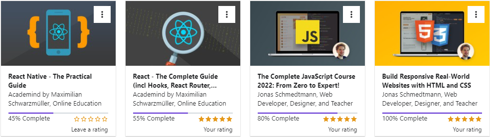

# Saikal Bakirova

## Frontend Developer

### Contacts:

---

- Phone number : _+996755129888_ • _+996554565607_
- E-mail : _sddbakirova@gmail.com_
- Telegram : _@sddbak_
- Discord: _Saikal(SaikalSdd)_
- _[LinkedIn](https://www.linkedin.com/in/saikal-bakirova/)_

### About:

---

My experience in working with JS and React is 1,5 years. I developed a ‘digital notebook’
mobile application for iOS/Android using React Native/Redux from
scratch and successfully published it into [Google Play](https://play.google.com/store/apps/details?id=com.bakirovasdd.digital_notebook_cell). I worked on this
project on my own: starting from app design till production, and it was
a great experience! Now I work on commercial projects - products in different domains in a team using modern technologies. I love React and it is real pleasure for me to work with this library. I hope my experience and completed projects will convince you of my abilities and my motivation to work and grow in your company.

## Education

---

- **University**:

  - International Ala-Too University • Applied Mathematics and Informatics

- **Certifications&Cources**:

  - [JavaScript - Udemy](https://www.udemy.com/course/the-complete-javascript-course/)
  - [React + Redux - Udemy](https://www.udemy.com/course/react-the-complete-guide-incl-redux/)
  - [React Native - Udemy](https://www.udemy.com/course/react-native-the-practical-guide/)

    

## Key Skills

---

| Technology Stack | Proficiency Level |
| ---------------- | ----------------- |
| JavaScript       | ⭐⭐⭐            |
| React.js         | ⭐⭐⭐            |
| Redux            | ⭐⭐⭐            |
| SQLite           | ⭐⭐⭐            |
| React Native     | ⭐⭐              |
| GIT              | ⭐⭐              |
| Storyblok        | ⭐⭐              |
| SCSS             | ⭐⭐              |
| Tailwind         | ⭐⭐              |
| Typescript       | ⭐                |
| Next.js          | ⭐                |

## Experience

---

_11/2021 - current_  
Software Engineer • Frontend Developer • DevelopsToday LTD

_11/2020 - 09/2021_  
Software Engineer • Digital Notebook Mobile Application "CELL"

_01/2019 – 01/2020_  
Frontend Developer • Intern • Neobis

## Projects

---

- Mobile application for iOS/Android using React Native, Redux, SQLite. The app is already in Google Play.

  - [Google Play](https://play.google.com/store/apps/details?id=com.bakirovasdd.digital_notebook_cell)
  - [Code Source](https://github.com/SaikalSdd/cell-app)
  - [App Demo](https://www.youtube.com/watch?v=SZVCg4qr_ms)

  - Used Technologies:
    - Figma
    - React Native
    - Redux
    - Expo
    - SQLite

- Owkin Web Platform
  - [owkin.com](https://owkin.com/)
  - Used technologies:
    - Next.js
    - Typescript
    - Storybook
    - Styled components (SCSS)

## Languages

---

| Language | Proficiency Level |
| -------- | :---------------: |
| English  |        B2         |

> Starting from 7th grade I studied in school where education was in English, and at the university also education was in English. In 10th grade I participated with my team of 3 people in World Scholars' Cup - debates in english and our team took 3rd place among 13 schools. Also, in 10th-11th grades I prepared for SAT and passed with 1116/1600 score. In other words, English plays big role in my life

## Code Example

Task:

Given a non-negative integer, 3 for example, return a string with a murmur: "1 sheep...2 sheep...3 sheep...". Input will always be valid, i.e. no negative integers.

const countSheep = (num) => {
//your code here
let countStr = ""
let count = 1

while(num > 0){
countStr = countStr.concat(`${count} sheep...`)
count ++
num --
}
return countStr
}
